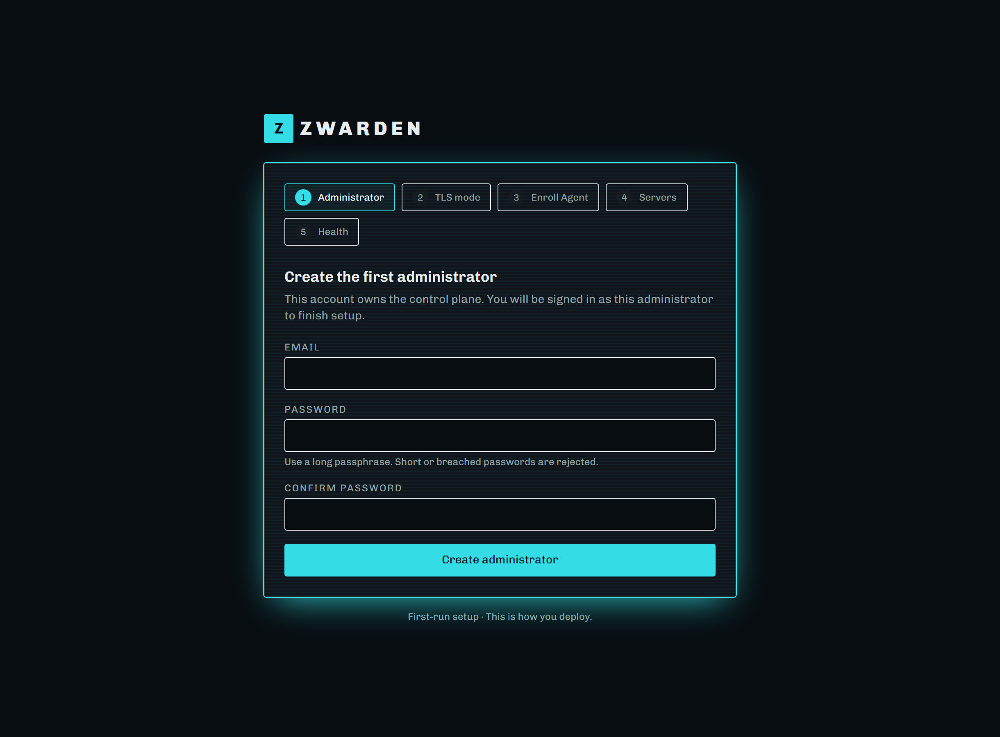
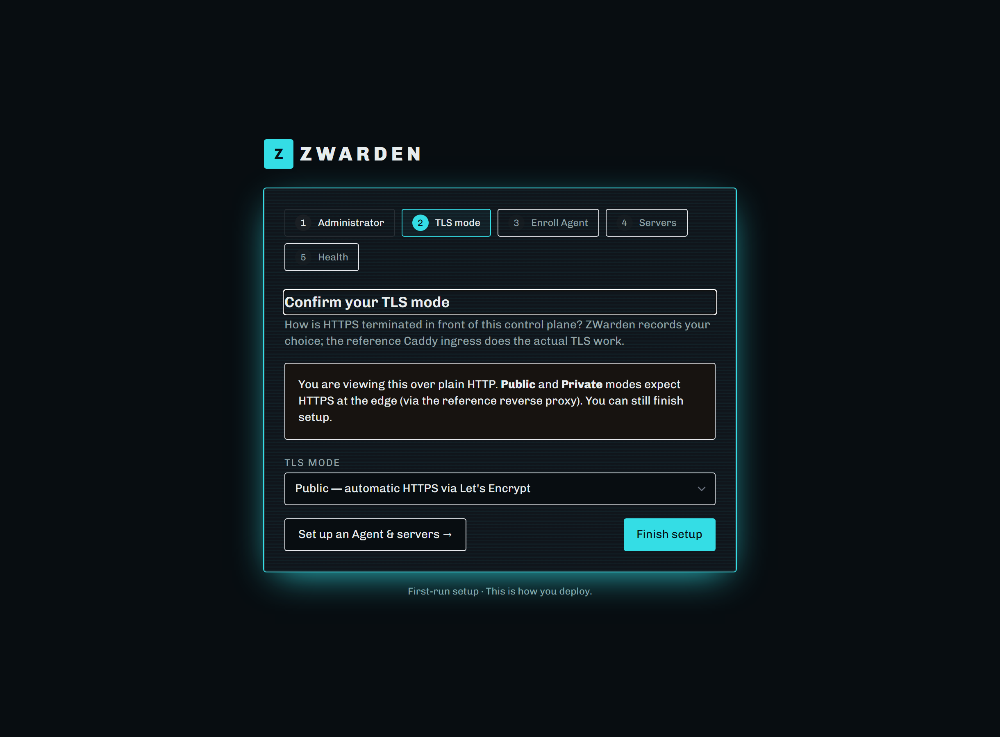
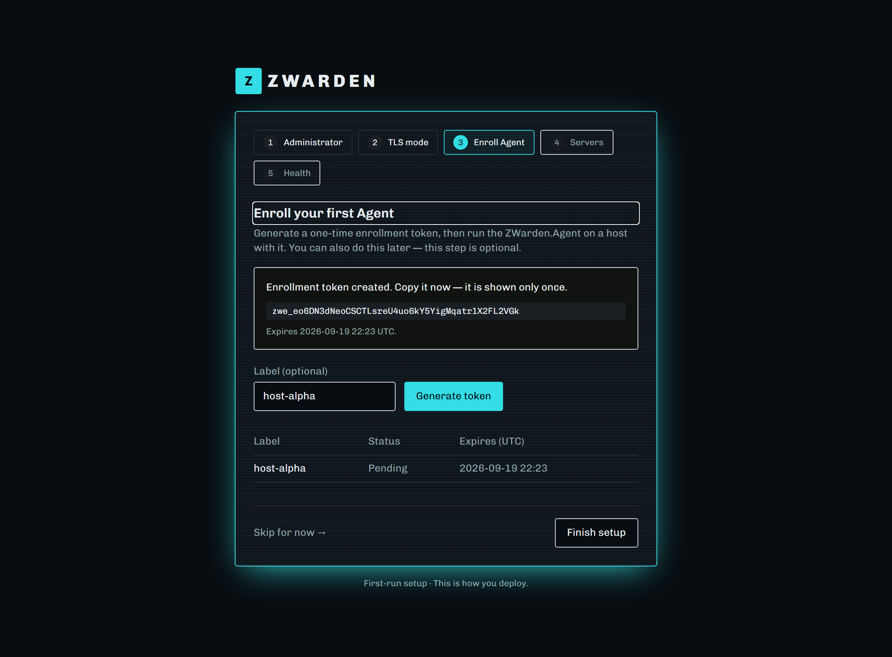
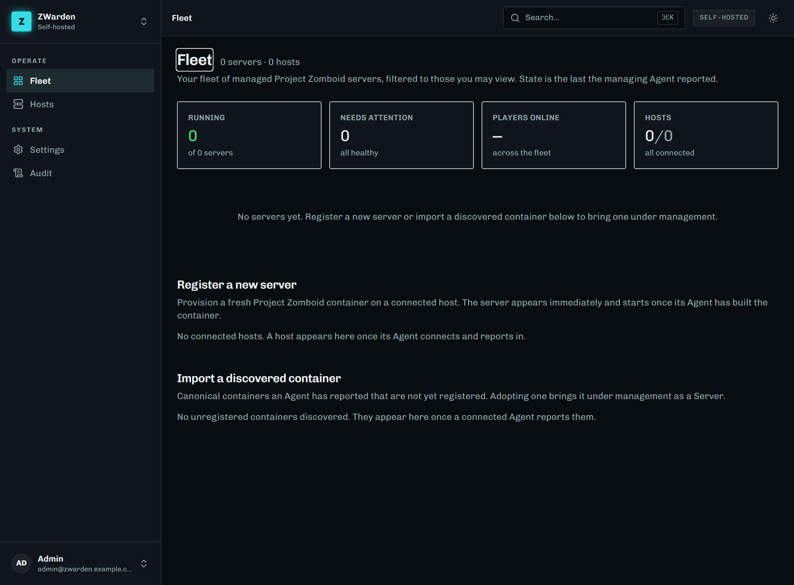

# Getting started — stand up ZWarden on your own domain

This is the friendly, start-to-finish walkthrough for a first self-hosted ZWarden install with a **public
domain and an automatic Let's Encrypt certificate** (the "Public" TLS mode). By the end you'll have the
control plane running behind HTTPS, an Agent connected, and your first Project Zomboid server provisioned.

Plan for about **15–20 minutes** of hands-on time, plus download waits (the .NET images the first time you
build, and a one-time ~7 GB Project Zomboid download when your first server boots).

> **Just want the reference details?** This guide is the guided tour. The exhaustive references are
> [`compose-reference.md`](./compose-reference.md) (every service, secret, and knob) and
> [`https-reference.md`](./https-reference.md) (all three TLS modes). Adding a *second* host later?
> [`remote-agent.md`](./remote-agent.md).

---

## What you'll end up with

```
                 Internet
                    │  80 / 443  (the only ports you open)
              ┌─────▼─────┐
              │   Caddy   │  HTTPS + automatic Let's Encrypt, redirects HTTP→HTTPS
              └─────┬─────┘
                    │
              ┌─────▼─────┐        ┌───────────────┐
              │    Web    │◄───────│     Agent     │  connects OUTBOUND over wss
              │ (control  │        │ (host worker) │
              │  plane)   │        └───────┬───────┘
              └───────────┘                │ (Docker, via a locked-down proxy)
                                     ┌──────▼───────────┐
                                     │  PZ server(s)    │  built on demand by the Agent
                                     └──────────────────┘
```

Only **Caddy** faces the Internet. The control plane, the Agent, and your game servers all sit behind it.

---

## Before you begin

You'll need:

- **A Linux host** with **Docker Engine** and the **Docker Compose v2** plugin (`docker compose version`).
- **A domain name** you control, e.g. `zwarden.example.com`, with a **DNS `A`/`AAAA` record** already
  pointing at the host's public IP. It must resolve *before* you start the stack.
- **Ports 80 and 443 open** inbound to the host from the Internet. Let's Encrypt validates over port 80
  (HTTP-01) and HTTPS serves on 443 — both must be reachable.
- **Outbound Internet** from the host (for Let's Encrypt and the Project Zomboid download via SteamCMD).

> **Using Cloudflare (or another proxy) for DNS?** Keep the ZWarden record **DNS-only ("grey cloud")**,
> not proxied ("orange cloud"). The Let's Encrypt HTTP-01 challenge and the Agent's WebSocket both need to
> reach your origin directly; a proxy in front of 80/443 will interfere. (DNS-01 wildcard issuance behind a
> proxy is a future advanced mode — see `https-reference.md`.)

---

## Step 1 — Get ZWarden onto the host

```bash
git clone https://github.com/MCrank/ZWarden.git
cd ZWarden/deploy/compose
```

Everything below runs from `deploy/compose`.

## Step 2 — Generate your secrets

One command writes a git-ignored `.env` with a freshly generated encryption key ring and database password:

```bash
./bootstrap-secrets.sh          # Windows host: pwsh ./bootstrap-secrets.ps1
```

> **⚠️ Back up the key ring.** `.env` holds `ZW_SECRET_KEYS` — the AES key the control plane uses to
> encrypt sensitive columns (like MFA secrets). **If you lose it, that data is unrecoverable.** The script
> refuses to overwrite an existing `.env` for exactly this reason. Copy `.env` somewhere safe.

## Step 3 — Set your domain

Open `.env` and set your hostname:

```dotenv
ZWARDEN_DOMAIN=zwarden.example.com
```

That's the only value you must set now. (An ACME contact e-mail is **optional** — Let's Encrypt doesn't
require one. If you'd like expiry/security notices, add an `email you@example.com` line to the global block
at the top of [`../caddy/Caddyfile`](../../deploy/caddy/Caddyfile); see `https-reference.md`.)

## Step 4 — (Recommended) pin the .NET base image before you build

The `web` and `agent` images build from a **floating** .NET base tag (`ARG DOTNET_VERSION=10.0`). A fresh
build can occasionally pull a bad upstream patch (see issue
[#204](https://github.com/MCrank/ZWarden/issues/204)). For a production build, pin `ARG DOTNET_VERSION` in
`src/ZWarden.Web/Dockerfile` and `src/ZWarden.Agent/Dockerfile` to a **specific patch or digest** you've
verified builds and runs (e.g. `10.0.12`, or an `mcr.microsoft.com/dotnet/...@sha256:...` digest). You can
skip this for a quick trial and revisit it before you rely on the box.

> Prefer not to build at all? A tagged release publishes **signed, digest-pinned** images to GHCR with a
> `compose.release.yaml`. See *Running signed release images* in [`compose-reference.md`](./compose-reference.md).

## Step 5 — Bring up the stack

```bash
docker compose up -d
```

This builds the images (first time only) and starts Caddy, the control plane, the socket-proxy, and the
Agent. Caddy will obtain your Let's Encrypt certificate on first start — this needs a few seconds and
working 80/443.

Watch it come up:

```bash
docker compose ps                 # Web should become "healthy"; Caddy and the Agent wait for that
docker compose logs -f caddy      # look for a successful certificate obtain, no ACME errors
```

> **PostgreSQL instead of SQLite?** SQLite (the default) is fine for a single host. For Postgres, bring the
> stack up with both files — `docker compose -f compose.yaml -f compose.postgres.yaml up -d` — and use that
> same `-f` pair for **every** later command. Decide before your first `up`; switching later is a data
> migration. Details in `compose-reference.md`.

## Step 6 — Finish setup in your browser

Open **`https://zwarden.example.com`**. On first run you're guided through a short wizard.

**1. Create the first administrator.** This account owns the control plane.



**2. Confirm your TLS mode.** Choose **Public — automatic HTTPS via Let's Encrypt** (what this guide set
up). ZWarden just records your choice; Caddy does the actual TLS work.



> *(The "you're viewing this over plain HTTP" banner only appears if you opened the wizard over `http://`.
> When you reach it via your `https://` domain — as you should — it won't show.)*

From here you can click **Finish setup** and stop, or **Set up an Agent & servers →** to continue into the
next (optional) steps in the browser. To connect the co-located Agent, continue to the enroll step.

**3. Enroll your first Agent.** Click **Generate token**. Copy the one-time enrollment token — it's shown
**only once**.



*(Your token will differ from the one pictured.)*

## Step 7 — Connect the Agent

Back on the host, paste that token into `.env`:

```dotenv
ZWARDEN_ENROLLMENT_SECRET=zwe_...paste-your-token...
```

Then recreate the Agent so it picks it up:

```bash
docker compose up -d agent
# (Postgres mode: docker compose -f compose.yaml -f compose.postgres.yaml up -d agent)
```

The Agent enrols **once**, saves its own credential, and connects. It never re-enrols on restart, so you can
blank `ZWARDEN_ENROLLMENT_SECRET` again afterwards. Confirm it connected under **Hosts** in the UI (it shows
the host with a **Connected** indicator).

> **In Private (internal-CA) TLS mode only**, the Agent must trust Caddy's CA before it can connect — see
> *Private mode: trusting Caddy's CA in the Agent* in `compose-reference.md`. In **Public** mode (this
> guide) the certificate is publicly trusted, so there's nothing extra to do.

## Step 8 — Build the PZ image and provision a server

Game servers run from a canonical Project Zomboid image the Agent builds them from. Build it and pin a
**specific** reference (any tag except a floating `latest`, which is rejected):

```bash
# from the repo root
docker build -t zwarden-pzserver:42.20.4 src/ZWarden.PZServer
```

Set it in `.env` and recreate the Agent:

```dotenv
ZWARDEN_PZ_IMAGE=zwarden-pzserver:42.20.4
```
```bash
docker compose up -d agent
```

> For a hardened production deploy, push the image to a registry and pin its `repo@sha256:…` **digest**
> instead. A locally built image that was never pushed has no digest — pin its build tag.

Now provision a server: in the UI go to **Fleet → Register a new server**, pick your host, give it a name,
and **Deploy**. The server appears immediately and starts once the Agent has built its container. **The
first boot downloads Project Zomboid (~7 GB) via SteamCMD**, so give it time; watch progress with
`docker logs -f <server-container>`.

Each server listens on a **pair of UDP ports** on the host: the game port and the one above it. If you leave
**Game port** blank, ZWarden takes the next free pair starting at **16261/16262** (then 16263/16264, …). To match
an existing firewall or port-forward rule, type the game port you want (1024–65534). Either way, **open or
forward both UDP ports** to the host so players can connect. RCON is never published.

You're in:



---

## Day-2 essentials

- **Where your worlds live.** Provisioned servers keep world data and backups on the host under
  **`/srv/zwarden`** (`pz-data/<server-id>` and `pz-backups/`). **Include `/srv/zwarden` in your backup
  routine**, and use the in-app backup/restore features too.
- **Changing a server's ports.** On the server's **Overview**, **Change host ports** recreates its container on
  a new UDP pair. The world, config and installed game are kept, so nothing is downloaded again. A running server
  warns players, stops safely and comes back on the new ports. If the new pair turns out to be taken, the server
  is rolled back to its old ports. Update your firewall or port-forward afterwards. Tenant Owners and
  Administrators can do this (`Server.Recreate`).
- **Health & logs.** `docker compose ps` for health; `docker compose logs -f web|agent|caddy` for live logs.
- **Upgrades.** Back up first, then `docker compose pull && docker compose build --pull && docker compose
  up -d`. Migrations run automatically on Web startup. (Add the `-f` overlay pair in Postgres mode.)
- **More hosts.** Add another machine with [`remote-agent.md`](./remote-agent.md) — no inbound ports needed
  on the remote host.

## If something's not right

- **Certificate won't issue (Public mode).** Confirm DNS points at the host and **80/443 are reachable from
  the Internet** (and DNS-only, not proxied). Check `docker compose logs caddy` for the ACME error.
- **Web is unhealthy.** Almost always a missing/blank `ZW_SECRET_KEYS` (it fails closed) or a bad connection
  string — `docker compose logs web`.
- **Agent won't appear under Hosts.** Check `docker compose logs agent`. Usually a stale/used enrollment
  token (they're single-use and short-lived — generate a fresh one) or, in Private mode, an untrusted CA.
- **Provisioning fails with "no such image".** Set `ZWARDEN_PZ_IMAGE` to your built PZ image and recreate
  the Agent — the socket-proxy denies image pulls by design.

Full troubleshooting and every configuration option live in
[`compose-reference.md`](./compose-reference.md).
