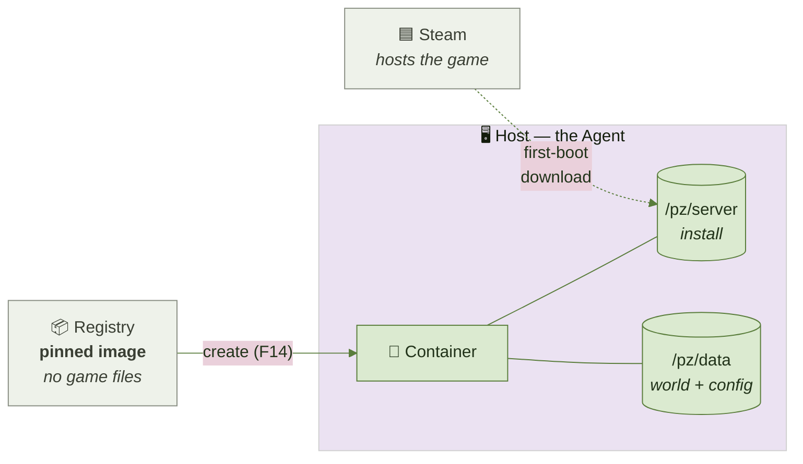
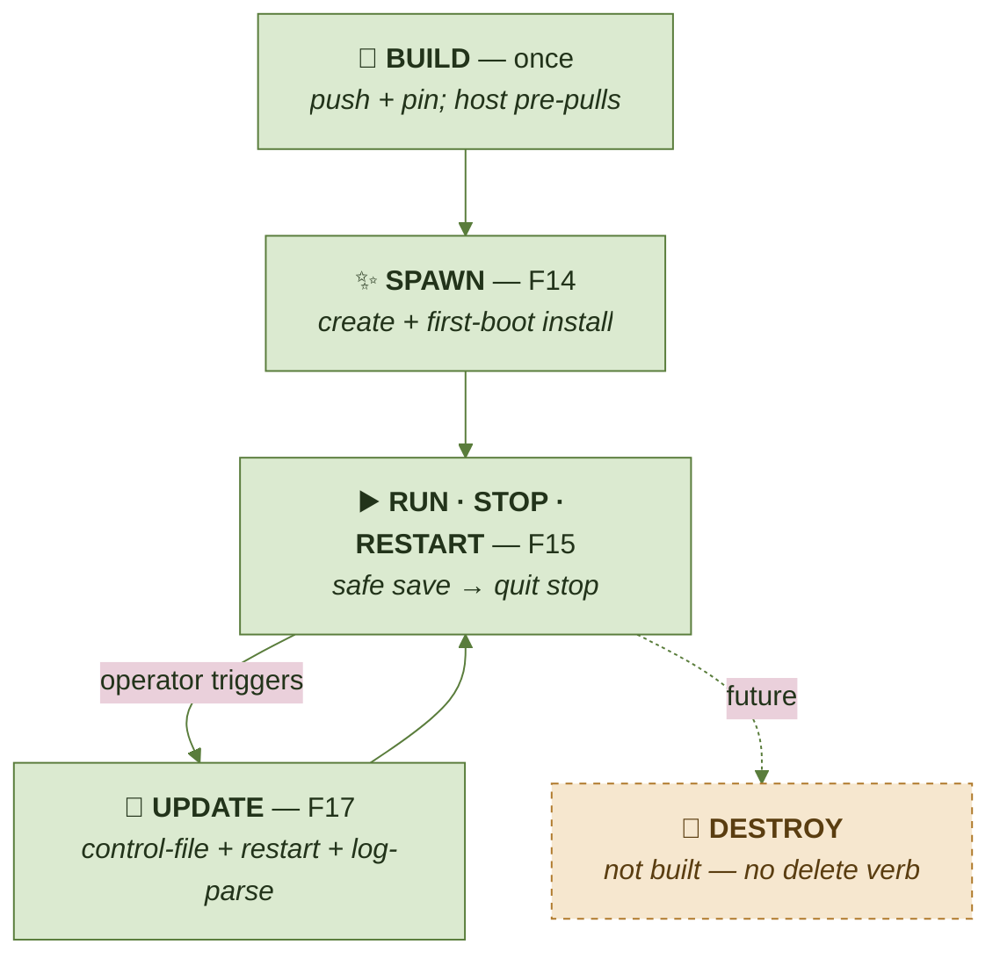

# ZWarden.PZServer — container architecture (overview)

> **🚧 Work in progress.** A living map of how the Project Zomboid server container is built, spawned,
> run, updated and configured. Last updated **2026-09-13** (through Feature 17). This is a **navigational
> overview, not the source of truth** — where it and an ADR disagree, the ADR wins. Update it as the
> features below land.
>
> **Diagrams:** flows/relationships are [Mermaid](https://mermaid.js.org/) (GitHub renders it) so they
> stay diffable and update in one line as the architecture moves; folder layouts stay ASCII (clearer for
> trees). A bespoke, zombie-themed SVG hero diagram is deliberately **deferred to the v1.0 polish pass** —
> the architecture is still changing every feature, and hand-drawn art wants a stable subject.

**Authoritative sources:** [ADR 0009](./adr/0009-steamcmd-at-runtime-is-mandatory.md) (SteamCMD at runtime),
[ADR 0008](./adr/0008-docker-socket-access-via-wollomatic-socket-proxy.md) (the Docker allowlist),
[ADR 0025](./adr/0025-steamcmd-update-orchestration.md) (updates), the
[PZServer README](../src/ZWarden.PZServer/README.md), and the F12/F13/F14/F15/F16/F17
[feature plans](./feature-plans/).

---

## The one idea to hold onto: image ≠ game files

We build **one small, shared image**, and each server **downloads the actual game itself on first boot**.
These are two different things, and keeping them apart is the whole design.



The image is **shared** (one, reused by every server); the game files are **per-server** (downloaded on
each host, never hosted by us).

**Why the split?** The Project Zomboid EULA (§3.2) forbids us from hosting or redistributing the game
download, so we **cannot** bake it into our image (ADR 0009). Our image ships only **SteamCMD** (which Valve
permits), and each container installs PZ **anonymously from Steam** on first run — no Steam account, no
credentials, and no binary hosted by us. The first install is a one-time cold-start cost per server; after
that the files persist and updates are incremental.

---

## Inside a running container (`/pz`)

```
/opt/steamcmd/            SteamCMD, baked into our image. Copied into /pz/runtime on boot.
                          (Lives OUTSIDE /pz so a mount can't shadow it.)

/pz/
├── server/               THE GAME INSTALL (SteamCMD app 380870)              [PERSISTENT]
│   ├── start-server.sh        the PZ launcher (we tune its heap)
│   ├── jre64/                 PZ's OWN bundled Java 25 — no system Java needed
│   ├── natives/  …
│   ├── steam_appid.txt        must contain exactly "108600"
│   └── steamapps/appmanifest_380870.acf   ← installed build id is read from here (F17)
│
├── runtime/              SteamCMD working copy + Steam root + the control FIFO   [EPHEMERAL]
│                         (a tmpfs — rebuilt from /opt/steamcmd every boot)
│
└── data/                 THE WORLD + CONFIG (PZ user-data, relocated via -cachedir)  [PERSISTENT]
    ├── Server/
    │   ├── servertest.ini            PZ settings (ports, RCON, max players, PvP…)
    │   ├── servertest_SandboxVars.lua sandbox rules (zombies, loot…)
    │   └── servertest_spawn*.lua
    ├── Saves/Multiplayer/servertest/ the saved world
    ├── db/                            player accounts / whitelist / bans
    └── Logs/  server-console.txt
```

Everything else (the root filesystem) is **read-only** for safety (ADR 0025). Only the two persistent
folders and the ephemeral `runtime` tmpfs are writable.

### On the host

The Agent runs on the host and owns a data root; it mounts two per-server folders into each container:

```
<DataMountRoot>/<serverId>          →  /pz/data     (world + config)   ← disk meter reads this
<DataMountRoot>/<serverId>.server   →  /pz/server   (the game install) ← a sibling, so the ~6.72 GiB
                                                                          is not counted as "world" usage
```

---

## Lifecycle: build → spawn → run → update → destroy



The Agent never runs the game itself and cannot `exec` into a container (ADR 0008) — it only creates,
starts, stops, restarts, and reads (inspect / logs / stats). Everything else happens inside the
container's own entrypoint.

---

## Configuration & memory — where each knob lives

There are two kinds of knobs, and **when** you set them matters.

### ① Spawn-time knobs (environment variables, set when the container is created)

| Knob | How | Default | Notes |
| --- | --- | --- | --- |
| JVM heap (the game's RAM) | Agent (`DefaultHeapSizeBytes`), injected as env `ZW_PZ_XMS` / `ZW_PZ_XMX` | `4 GiB` | For a managed container the Agent owns the heap and injects it, overriding the image's standalone `4g` default; the entrypoint rewrites the launcher's heap from it. |
| Container memory **cap** | Agent (`DefaultMemoryLimitBytes`), derived from heap + `MemoryOverheadBytes` | `10 GiB` (4 GiB heap + 6 GiB overhead) | A hard cgroup ceiling. It **must exceed the heap** — ZGC/native/metaspace and a fresh world's off-heap boot run well above the Java heap, so a cap equal to the heap OOM-kills on boot (#198). The Agent derives it from the heap so the two cannot drift, and fails closed if `cap ≤ heap`. |
| PZ version / branch | env `ZW_PZ_BETA` | empty = `public` (42.20.x) | e.g. `legacy41`, `42.19`. |
| Server name (config set) | env `ZW_PZ_SERVERNAME` | `servertest` | Which `servertest.*` set PZ loads. |
| Safe-stop grace | env `ZW_PZ_STOP_GRACE` | `30`s | Seconds between `save` and `quit`. |
| Game / query ports | Agent allocates (2 per server) | — | Two UDP ports; RCON is private, never published. |

Because these are environment variables, changing heap or version today means **recreating** the
container (env can't be changed on a live one).

### ② In-world settings (files in `/pz/data/Server/`, generated on first run)

- `servertest.ini` — classic PZ server settings (max players, RCON, PvP, …)
- `servertest_SandboxVars.lua` — sandbox rules (zombie behavior, loot rarity, …)

These persist with the world. **Editing them safely through ZWarden is Features F20a/F20b — not built
yet.** Today they exist and PZ manages them; ZWarden has no config editor.

---

## Built vs. not (as of 2026-09-13)

| Capability | Feature | Status |
| --- | --- | --- |
| The canonical image + first-run install | F12 | ✅ |
| Agent Docker runtime (create/start/stop/restart, ownership, allowlist) | F13 | ✅ |
| Register / import a server (spawn) | F14 | ✅ |
| Start / stop / restart lifecycle | F15 | ✅ |
| Health & metrics | F16 | ✅ |
| SteamCMD update / validate + installed build id | F17 | ✅ |
| **Edit PZ config / sandbox settings** | F20a / F20b | ⛔ not built |
| **Workshop / mods** | F21 / F22 | ⛔ not built |
| **RCON client + health probe** | F18 | ✅ built (private-network transport, Agent-owned credential; ADR 0026) |
| **RCON console** | F28 | ✅ built — arbitrary RCON over F18 on the server-detail page, elevated `Console.Execute`, denylist + input safety, non-mutating audited Operations, untrusted bounded output, live output pane (ADR 0032) |
| **Diagnostics engine** | F29 | ✅ built — read-only aggregating sweep over ten domains (DB/TLS/Web/Agent in-process; Docker/RCON/game-port/filesystem/SteamCMD/mods/config/compatibility gathered over two non-mutating Operations); tenant-wide `Diagnostics.View`; ownership-guarded transient cache; per-server card on server-detail; all detail untrusted/escaped; no remediation (ADR 0033) |
| **Support package** | F30 | ✅ built — Web-side, transient: collect the F29 report → sanitize/redact/pseudonymize → **fail-closed secret scan** (a detection aborts generation, PRD 51) → ZIP (`manifest.json` + `diagnostics.json`, per-entry SHA-256) streamed as a download; tenant-wide `Diagnostics.Export`, audited; `DiagnosticId` correlation id; pure I/O-free pipeline core (ADR 0034) |
| **Destroy / deprovision a server** | (future) | ⛔ not built |

---

*Keep this current: when a ⛔ row lands, flip it to ✅ and add the mechanism above. If a mechanism here
starts to disagree with an ADR, fix the doc — the ADR is the contract.*
